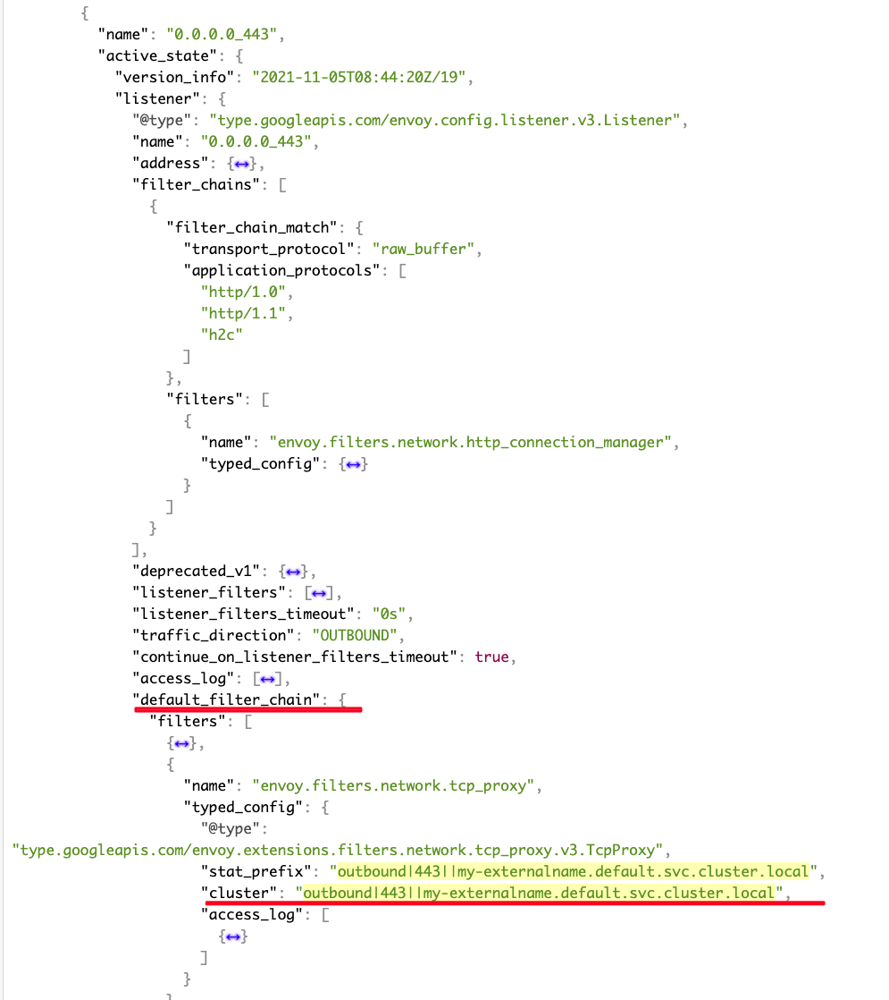

# ExternalName Service 劫持了其他服务流量

## 故障现象

如果网格内存在一个 ExternalName 类型 Service, 网格内访问其他外部服务的的某一端口，如果这个端口刚好和该 ExternalName Service 重叠，那么流量会被路由到这个 ExternalName Service 对应的 CDS。

## 故障重现

### 正常情况

在 namespace sample 安装 sleep Pod：

```
kubectl create ns sample
kubectl label ns sample istio-injection=enabled
kubectl -nsample apply -f https://raw.githubusercontent.com/istio/istio/1.11.4/samples/sleep/sleep.yaml
```

通过 sleep 访问外部服务 https://httpbin.org:443, 请求成功：

```
kubectl -nsample exec sleep-74b7c4c84c-22zkq -- curl -I https://httpbin.org
HTTP/2 200
......
```

从 access log 确认流量是从 PassthroughCluster 出去，符合预期：

```
"- - -" 0 - - - "-" 938 5606 1169 - "-" "-" "-" "-" "18.232.227.86:443" PassthroughCluster 172.24.0.10:42434 18.232.227.86:443 172.24.0.10:42432 - -
```

### 异常情况

现在 在 default 下创建一个 ExternalName 类型的 Service, 端口也是 443:

```
kind: Service
apiVersion: v1
metadata:
  name: my-externalname
spec:
  type: ExternalName
  externalName: bing.com
  ports:
  - port: 443
    targetPort: 443
```

通过 sleep 访问外部服务 https://httpbin.org:443, 请求失败：

```
kubectl -nsample exec sleep-74b7c4c84c-22zkq -- curl -I https://httpbin.org
curl: (60) SSL: no alternative certificate subject name matches target host name 'httpbin.org'
More details here: https://curl.se/docs/sslcerts.html
......
```

查看 access log, 发现请求外部服务，被错误路由到了 my-externalname 的 ExternalName Service:

```
"- - -" 0 - - - "-" 706 5398 67 - "-" "-" "-" "-" "204.79.197.200:443" outbound|443||my-externalname.default.svc.cluster.local 172.24.0.10:56806 34.192.79.103:443 172.24.0.10:36214 httpbin.org -
```

## 故障原因

通过对比 sleep Pod 前后两次的 xDS， 发现增加了 ExternalName Service 后，xDS 里会多一个 LDS `0.0.0.0_443`, 该 LDS 包括一个`default_filter_chain` 会把该 LDS 中其他 filter chain 没有 match 到的流量，都路由到这个 `default_filter_chain` 中的 Cluster，也就是 `my-externalname` 对应的 CDS:





## 解决方案

该问题属于 Istio 实现缺陷，相关 issue： https://github.com/istio/istio/issues/20703

目前的解决方案是避免 ExternalName Service 和其他服务端口冲突。
