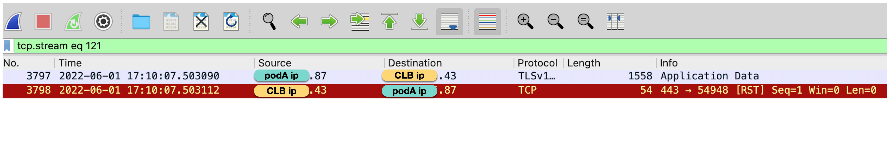
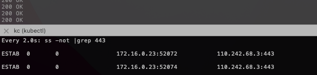

# 长连接未开启 tcp keepalive

## 故障现象
用户反馈链路偶发 500 错误，频率低但是持续存在。

用户访问链路较长，核心链路简化如下：

```
1. client -> 
2. [istio ingress gateway] -> 
3. podA[app->sidecar] -> 
4. 腾讯云内网CLB ->
5. [istio ingress gateway] -> 
6. podB[sidecar->app]
```

应用对外是 https 服务，证书在 istio ingress gateway 上处理。

## 故障分析

通过分析链路中 sidecar accesslog 日志，有以下现象：

1. 第 3 跳 podA 正常发出请求，但接收到 500 返回。
2. 第 5 跳 istio ingress gateway 没有该 500 对应的访问日志。

因此重点分析 第 3，4，5 跳。


在第 3 跳 podA 上抓到 500 对应的数据包：





抓包显示，podA 向一个已经断开的连接发送数据包，收到 RST 因此返回 500，但抓包并没有发现这个连接之前有主动断开的行为（FIN）。

登录 podA，查看连接情况:


ss 显示用户代码里使用了 tcp 长连接，注意这里我们使用了 ss 参数 `-o`, 该参数可以显示 tcp keepalive timer 信息：

```
 -o, --options
        Show timer information. For TCP protocol, the output
        format is:

        timer:(<timer_name>,<expire_time>,<retrans>)

        <timer_name>
               the name of the timer, there are five kind of timer
               names:

               on : means one of these timers: TCP retrans timer,
               TCP early retrans timer and tail loss probe timer

               keepalive: tcp keep alive timer

               timewait: timewait stage timer

               persist: zero window probe timer

               unknown: none of the above timers

        <expire_time>
               how long time the timer will expire

        <retrans>
               how many times the retransmission occurred
```

但从 ss 结果并未看到 timer 信息，推断 podA 使用的长连接并未开启 keepalive。


## 故障原因

podA 使用了 tcp 长连接，但是没有开启 keepalive，当长连接出现一段时间空闲，该连接可能被网络中间组件释放，比如 client、server 端的母机, 但 client 端还是持有断开连接，后续重用该链接就会导致上述异常。

## 解决方案

问题本质是因为长连接 idle 过长，且缺乏探活机制，导致 client 没感知到连接已释放，尝试三种方案：

1. 应用代码修复
2. istio 方案：client sidecar 开启 keepalive
3. istio 方案：server 开启 keepalive

### 应用代码修复

最直接的方案是应用在使用长连接时，开启 tcp keepalive，以 golang 程序示例，我们尝试用长连接访问 https://www.baidu.com

先模拟使用长连接但不开启 keepalive:

```golang
var HTTPTransport = &http.Transport{
	DialContext: (&net.Dialer{
		Timeout:   10 * time.Second,
		KeepAlive: -1 * time.Second, // disable TCP KeepAlive
	}).DialContext,
	MaxIdleConns:        50,
	IdleConnTimeout:     60 * time.Second,
	MaxIdleConnsPerHost: 20,
}

func main() {
	uri := "https://www.baidu.com"
	times := 200

	client := http.Client{Transport: HTTPTransport}
	for i := 0; i < times; i++ {
		time.Sleep(2 * time.Second)
		req, err := http.NewRequest(http.MethodGet, uri, nil)
		if err != nil {
			fmt.Println("NewRequest Failed " + err.Error())
			continue
		}
		resp, err := client.Do(req)
		if err != nil {
			fmt.Println("Http Request Failed " + err.Error())
			continue
		}
		fmt.Println(resp.Status)
		ioutil.ReadAll(resp.Body)
		resp.Body.Close()
	}
```

注意 `KeepAlive: -1` 表示禁用了 tcp keepalive 探活，ss 查看：



结果显示长连接缺乏 timer。注意测试 pod 在 istio 环境，上述第一个连接是 go 程序到 envoy，第二个连接是 envoy 到 baidu。

golang 代码修复方案很简单，只需要把 `KeepAlive` 设置为非负数, 代码修改

```golang
var HTTPTransport = &http.Transport{
	DialContext: (&net.Dialer{
		Timeout:   10 * time.Second,
		KeepAlive: 120 * time.Second, // keepalive 设置为 2 分钟
	}).DialContext,
	MaxIdleConns:        50,
	IdleConnTimeout:     60 * time.Second,
	MaxIdleConnsPerHost: 20,
}
```

ss 查看连接情况：


ss 显示 go client 到 envoy 开启了 keepalive，问题解决。

**但用户应用程序较多，不方便逐一调整 keepalive，希望通过 istio sidecar 来解决上述问题**。keepalive 可以在 client、server 任意一端开启，以下是使用 istio 的两种方案：


### istio 方案：client sidecar 开启 keepalive

该方案需要client 注入 istio sidecar，仍以访问 baidu https 为例，外部服务在 istio 中默认转发到 PassthroughCluster, 要对指定外部服务流量进行流控，我们需要先给该服务创建一个 service entry：

```yaml
apiVersion: networking.istio.io/v1alpha3
kind: ServiceEntry
metadata:
  name: baidu-https
spec:
  hosts:
  - www.baidu.com
  location: MESH_EXTERNAL
  ports:
  - number: 443
    name: https
    protocol: TLS
```

然后增加 tcp keepalive 设置:

```yaml
apiVersion: networking.istio.io/v1alpha3
kind: DestinationRule
metadata:
  name: baidu-https
spec:
  host: www.baidu.com
  trafficPolicy:
    connectionPool:
      tcp:
        maxConnections: 100
        tcpKeepalive:
          time: 600s
          interval: 75s
          probes: 9
```


ss 显示 go client 到 envoy 并没有 keepalive, 但 envoy 到 baidu 开启了 keepalive。


### istio 方案：server 开启 keepalive

用户异常链路的 server 入口 是 CLB 后端的 ingress gateway，在 ingress gateway 上开启 keepalive 会稍微复杂一点，需要使用 envoyfilter 来设置 socekt options:

```
apiVersion: networking.istio.io/v1alpha3
kind: EnvoyFilter
metadata:
  name: ingress-gateway-socket-options
  namespace: istio-system
spec:
  configPatches:
  - applyTo: LISTENER
    match:
      context: GATEWAY
      listener:
        name: 0.0.0.0_443
        portNumber: 443
    patch:
      operation: MERGE
      value:
        socket_options:
        - int_value: 1
          level: 1                         # SOL_SOCKET
          name: 9                          # SO_KEEPALIVE
          state: STATE_PREBIND
        - int_value: 9
          level: 6                         # IPPROTO_TCP
          name: 6                          # TCP_KEEPCNT
          state: STATE_PREBIND
        - int_value: 600
          level: 6                         # IPPROTO_TCP
          name: 4                          # TCP_KEEPIDLE
          state: STATE_PREBIND
        - int_value: 75
          level: 6                         # IPPROTO_TCP
          name: 5                          # TCP_KEEPINTVL
          state: STATE_PREBIND
```

上述配置的含义是：对于 433 LDS，tcp 连接设置 socket options：连接空闲 600s 后，开始发送探活 probe；如果探活失败，会持续探测 9 次，探测间隔为 75 s。

在 ingress gateway 上 ss, 显示 443 上连接都开启了 keepalive: 


如果用户 client 较多不便调整，更适合在 server （ingress gateway）开启 keepalive。另外该方案对 client 有无 sidecar 没有要求。

## 总结

使用长连接时，应用需要设置合理的 keepalive 参数，特别是对于访问频次较低的场景，以及链路较长的情况。

**istio 无入侵式的流量操纵能力，可以很方便的对流量行为进行调优，这也是用户选择 istio 的重要原因。**

---

## 参考资料

* https://www.envoyproxy.io/docs/envoy/latest/api-v3/config/core/v3/socket_option.proto
* https://github.com/envoyproxy/envoy/issues/3634
* https://github.com/istio/istio/issues/28879
