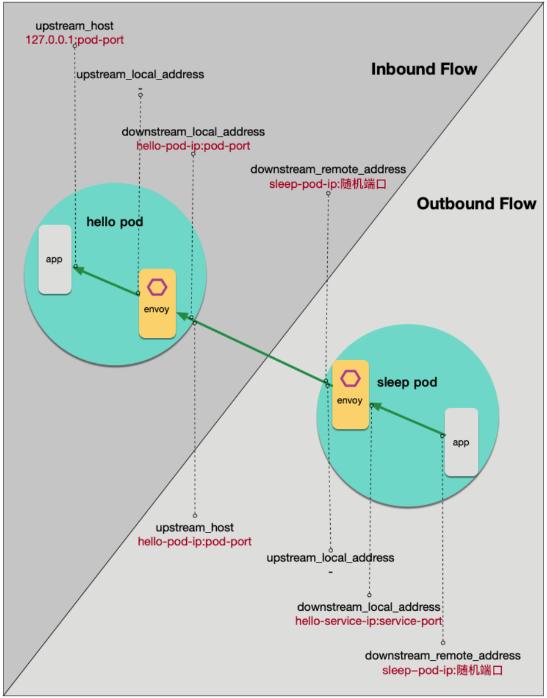

# 数据面 Envoy 日志调试指南

## 1. 问题背景

这是使用 Istio 最常见的困境：在微服务中引入 Envoy 作为代理后，当流量访问和预期行为不符时，用户很难快速确定问题是出在哪个环节。客户端收到的异常响应，诸如 403、404、503 或者连接中断等，可能是链路中任一 Sidecar 执行流量管控的结果， 但也有可能是来自某个服务的合理逻辑响应。

特别的，当 Service Mesh 系统的维护者和应用程序的开发者来自不同的团队时，问题尤为凸显。

在 Mesh 中引入全链路跟踪系统，可以解决部分问题，我们可以知道请求到达了哪些工作负载，但是对于中断的异常请求，我们仍然很难确定原因。 因为本着最大透明化（Maximize Transparency）的设计目标，Istio 的遥测系统会尽量屏蔽掉 Sidecar 的存在。另一方面，用户自行维护一套全链路跟踪系统成本也很高，受限于遥测采样率和有限的协议支持，我们通常无法采集所有链路数据。

幸运的是，Envoy 本身可以记录流量的信息，本文主要介绍如何利用 Envoy 日志，对类似问题进行定位。

---

## 2. Envoy 流量模型

我们先看看 Envoy 的流量模型：

1. 监听，接受连接
2. 根据用户流量操纵规则，进行流量特征识别
3. 进行流量操纵，如负载均衡，转发，拒绝等

在以上流程中， Envoy 接受请求流量叫做 **Downstream**，Envoy 发出请求流量叫做 **Upstream**。在处理 Downstream 和 Upstream 过程中， 分别会涉及 2 个流量端点，即请求的发起端和接收端：


在这个过程中， Envoy 会根据用户规则，计算出符合条件的转发目的主机集合，这个集合叫做 **UPSTREAM_CLUSTER**,  并根据负载均衡规则，从这个集合中选择一个 host 作为流量转发的接收端点，这个 host 就是 **UPSTREAM_HOST**。

以上就是 Envoy 请求处理的 **流量五元组信息**， 这是 Envoy 日志里最重要的部分，通过这个五元组我们可以准确的观测流量「从哪里来」和「到哪里去」。

* UPSTREAM_CLUSTER
* DOWNSTREAM_REMOTE_ADDRESS
* DOWNSTREAM_LOCAL_ADDRESS
* UPSTREAM_LOCAL_ADDRESS
* UPSTREAM_HOST

---

## 3. Helloworld example

在 Istio 场景中，Envoy 既可以是正向代理，也可以是反向代理。在上图中， 如果 Envoy 处理的是 Outbound 流量， 业务容器是作为 Downstream 端点（右边）；如果 Envoy 处理的是 Inbound 流量， 业务容器是作为 Upstream 端点（左边）。

Istio 中默认不开启 Envoy 中的访问日志，需要手动打开，将 Istio 配置中 `accessLogFile` 设置为 `/dev/stdout`：

```yaml
% kubectl -n istio-system edit cm istio
......
# Set accessLogFile to empty string to disable access log.
accessLogFile: "/dev/stdout" # 开启日志

accessLogEncoding: 'JSON' # 默认日志是单行格式， 可选设置为 JSON
......
```

我们以 sleep Pod 访问 hello 服务来举例说明：

```shell
kubectl apply -f sleep-hello.yaml
```


该文件定义了 2 个版本的 helloworld 和一个 sleep Pod，helloworld Service 的端口是 4000， 而 Pod 的端口是 5000。

从 sleep Pod 中去访问 helloworld 服务, 确认应用正常：

```shell
% SLEEP_POD=$(kubectl get pod -l app=sleep -o jsonpath="{.items[0].metadata.name}")
% HELLO_V1_POD=$(kubectl get pod -l app=helloworld -l version=v1 -o jsonpath="{.items[0].metadata.name}")
% kubectl exec -it $SLEEP_POD -csleep -- sh
/ # curl helloworld:4000/hello
```

这时候我们可以去分析 2 个 Pod 各自的 Envoy 日志：


用一张图来说明：



从日志中我们可以分析出：

对于 sleep Pod， sleep app 发出的流量目的端是 hello Service ip 和 Service port，sleep Envoy 处理的是 Outbound 流量， Envoy 根据规则选择的 「UPSTREAM_CLUSTER」是 `outbound|4000||helloworld.default.svc.cluster.local `, 然后转发给其中的一个 「UPSTREAM_HOST」, 也就是 hello Pod 的 ip 和 port。

对于 hello Pod，其 Envoy 处理的是 Inbound 流量，Envoy 根据规则选择的 「UPSTREAM_CLUSTER」 是 `inbound|4000|http|helloworld.default.svc.cluster.local `, 其中的 「UPSTREAM_HOST」 是 「127.0.0.1:5000」, 也就是该 Pod 里的 hello app。

因此，我们可以总结出 Istio 中流量端点值的逻辑规则：

#### UPSTREAM_HOST

上游主机的 host，表示从 Envoy 发出的请求的目的端，通常是「ip:port」

通常来说，对于 Outbound Cluster，此值是「上游 pod-ip : pod-port」 ，而对于 Inbound Cluster，此值是「127.0.0.1 : pod-port」

#### UPSTREAM_LOCAL_ADDRESS

 上游连接中，当前 Envoy 的本地地址，此值是「当前 pod-ip : 随机端口」

#### DOWNSTREAM_LOCAL_ADDRESS

 下游连接中，当前 Envoy 的本地地址。

通常来说，对于 Outbound Cluster，此值是「目的 service-ip : service-port 」，而对于 Inbound Cluster，此值是「当前 pod-ip : pod-port」

#### DOWNSTREAM_REMOTE_ADDRESS

下游连接中远端地址。

通常来说，对于 Outbound Cluster，此值是「当前 pod-ip : 随机端口 」，而对于 Inbound Cluster，此值是「下游 pod-ip : 随机端口」

---

## 4. Envoy 日志格式

Envoy 允许定制日志格式， 格式通过若干「Command Operators」组合，用于提取请求信息，Istio 没有使用 Envoy 默认的日志格式， Istio 定制的访问日志格式如下：


完整的「Command Operators」含义可查阅 [Envoy Access logging Command Operators](https://www.envoyproxy.io/docs/envoy/latest/configuration/observability/access_log/usage#command-operators)

除了以上流量五元组，流量分析中常用的重要信息还有：

#### RESPONSE_CODE

响应状态码

#### RESPONSE_FLAGS

 很重要的信息，Envoy 中自定义的响应标志位， 可以认为是 Envoy 附加的流量状态码。

如「NR」表示找不到路由，「UH」表示 Upstream Cluster 中没有健康的 host，「RL」表示触发 rate limit，「UO」触发断路器。

`RESPONSE_FLAGS` 可选值有十几个，这些信息在调试中非常关键。

#### X-REQUEST-ID

一次 C 到 S 的 http 请求，Envoy 会在 C 端生产 request id，并附加到 header 中，传递到 S 端，在 2 端的日志中都会记录该值， 因此可以通过这个 ID 关联请求的上下游。注意不要和全链路跟踪中的 trace id 混淆。

#### ROUTE_NAME

匹配执行的路由名称

---

## 5. 场景：判断异常返回是来自业务还是 Sidecar？

比如我们希望所有请求 helloworld 都路由到 v1 版本，创建对应的 VirtualService：

```shell
% kubectl apply -f hello-v1-virtualservice.yaml
```

```yaml
apiVersion: networking.istio.io/v1alpha3
kind: VirtualService
metadata:
  name: hello
spec:
  hosts:
    - "helloworld"
  http:
    - route:
      - destination:
          host: helloworld
          subset: v1
          port:
            number: 4000
```

从 sleep 中访问发现响应 503：


如果没有上下文，我们很难判断 503 是来自业务容器还是 Sidecar，查看 sleep 和 hello 的 Envoy 日志，可以发现：hello Pod 的 Envoy 没有接受到请求，sleep Pod 的 Envoy 里日志：


其中 `"response_flags": "NR"` 表示「No route configured」，也就是 Envoy 找不到路由，我们可以判断出该异常是有 Envoy 返回。

通过简单的分析就可以找到原因， 我们在 VirtualService 中使用的 Destination 没有定义，将其补上：

```shell
% kubectl apply -f hello-v1-destinationrule.yaml
```

```yaml
apiVersion: networking.istio.io/v1alpha3
kind: DestinationRule
metadata:
  name: hello
spec:
  host: helloworld
  subsets:
    - name: v1
      labels:
        version: v1
```

再次访问请求正常，日志中 `response_flags` 为空：


---

## 6. 开启 debug 模式

Envoy 默认日志级别是 info，其日志内容能满足大部分调试场景需求，但对于比较复杂的异常，我们往往还需要开启 debug 级别，能获取到更多的流量处理过程和信息，对某个特定的 Pod，调整日志级别为 debug 的命令：

```
kubectl exec {POD-NAME} -c istio-proxy -- curl -X POST http://127.0.0.1:15000/logging?level=debug
```

